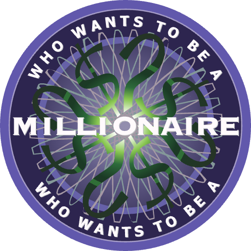

# Who Wants to Be a Millionaire

<p align="center">
  
</p>

A fun and interactive pet project inspired by Who Wants to Be a Millionaire.

## Project Overview

- This is a [Next.js](https://nextjs.org) project bootstrapped with [`create-next-app`](https://nextjs.org/docs/app/api-reference/cli/create-next-app).
- Uses [Redux Toolkit](https://redux-toolkit.js.org) for state management.
- UI designed with [MUI](https://mui.com) for flexible design system and responsive components.
- Utilizes [Husky](https://typicode.github.io/husky) for Git hooks.

  - Pre-commit hook runs `eslint` to ensure code quality.
  - Pre-push hook runs tests to ensure code stability.

## Installation

1. Clone the repository:

   ```bash
   git clone https://github.com/grrryts/wwbm.git
   cd wwbm
   ```

2. Install dependencies:

   ```bash
   yarn install
   ```

   This will install all the required packages and dependencies for the project.

3. To start the development server, run the following command:

   ```bash
   yarn dev
   ```

   This will start the Next.js development server on [http://localhost:3000](http://localhost:3000). Open with your browser to see the result.
